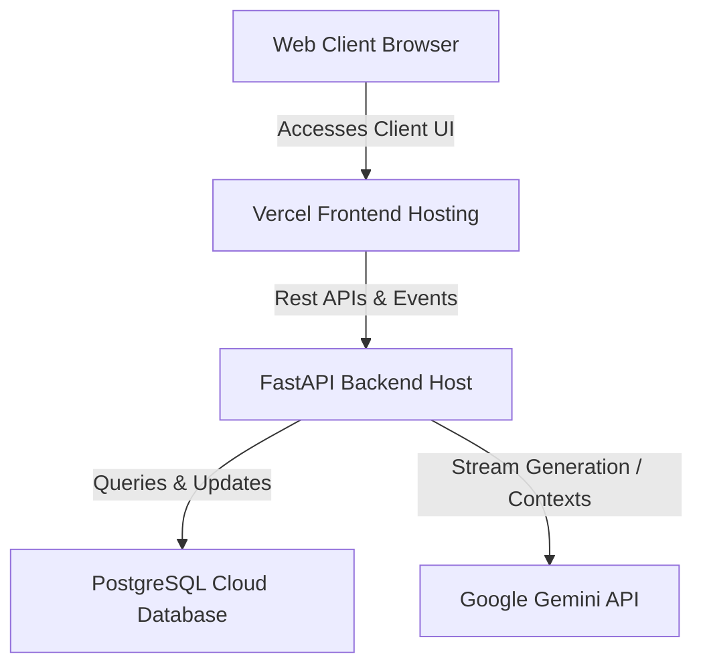

# CareerPrep AI - Full Stack AI Placement Mentorship Platform

**CareerPrep AI** is an intelligent, full-stack placement preparation platform designed to accelerate student readiness for technical and non-technical job roles. The platform utilizes advanced AI to build personalized preparation tracks, assess answers with real-time feedback, and maintain daily study consistency.

---

## 🏗️ Repository Layout (GitHub Guide)

Since you are hosting the client and API services in separate GitHub repositories, you should organize them as follows:

1.  **Frontend Repository (`frontend/` folder)**:
    *   Push the contents of the `frontend/` folder directly to your frontend GitHub repository.
    *   Keep the **[`frontend/README.md`](file:///c:/Users/Admin/OneDrive/Desktop/training%20program/AI%20Placement%20Mentor/frontend/README.md)** at the root of that repository.
2.  **Backend Repository (`backend/` folder)**:
    *   Push the contents of the `backend/` folder directly to your backend GitHub repository.
    *   Keep the **[`backend/README.md`](file:///c:/Users/Admin/OneDrive/Desktop/training%20program/AI%20Placement%20Mentor/backend/README.md)** at the root of that repository.

---

## 🎨 Feature Overview

### 1. Interactive Checkpoint Roadmap
Replaces plain text guidelines with a vertical timeline node tree. Students expand weekly checkpoints, view target topics, check off completed milestones, and track status counters cached locally by user profile.

### 2. Immersive Mock Interviews
Practice HR, Technical, and Mixed rounds. The platform utilizes **SpeechSynthesis** to speak questions aloud as they load. Students answer by clicking the microphone button to transcribe their spoken answers via **SpeechRecognition**. Answers receive a dynamic evaluation grade out of 100% and detailed AI feedback reports.

### 3. Multimodal Mentor Chat
Includes standard text chat along with a file uploader (`+`) for study guides, PDFs, or code screenshots.
*   **PDFs**: Uses `pypdf` text extraction in the backend to feed documents as query contexts.
*   **Images**: Encodes files using Gemini's native multimodal API (`types.Part.from_bytes`) to inspect code logic and diagrams.
*   **Voice Inputs**: Microphone dictation directly integrated inside the input bar.

### 4. Core Dashboard Analytics & Streaks
Calculates the profile placement readiness score dynamically using a weighted formula:
$$\text{Readiness Score} = (45\%\text{ Mock Interview Avg}) + (35\%\text{ Task Completion}) + (20\%\text{ Streak Score})$$
Includes browser desktop notification reminders prompting users to log actions and maintain their learning streaks.

### 5. Multi-Step Onboarding Flow
A beautiful step-by-step setup wizard (`Goals` -> `Skills` -> `Timeline`) to customize preparation paths, preferred industry, study hours, and target role criteria.

### 6. Light & Dark Themes
Elegant glassmorphic designs built using custom CSS stylesheet overrides, switching layout schemes smoothly while persisting selections inside local storage.

---

## 📦 System Architecture



---

## ⚙️ Quick Start Checklist

### Backend setup (Service API)
```powershell
cd backend
py -3.13 -m venv venv
venv\Scripts\python.exe -m pip install -r requirements.txt
# Configure your .env parameters
venv\Scripts\python.exe -m alembic upgrade head
venv\Scripts\python.exe -m uvicorn main:app --reload
```

### Frontend setup (Client UI)
```powershell
cd frontend
npm.cmd install
# Configure your .env (VITE_API_URL=http://localhost:8000)
npm.cmd run dev
```
